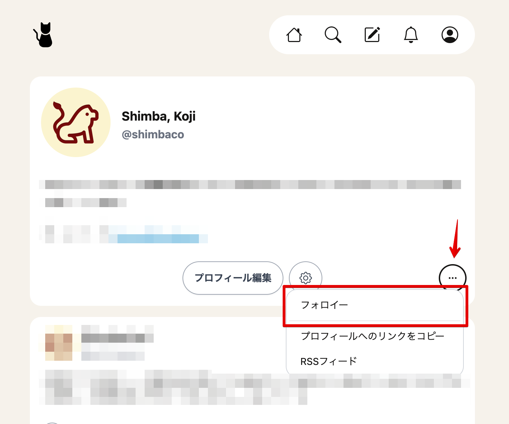

自分がフォローしているプロフィールの一覧ページを作りました。

https://mewst.com/followees

プロフィールページに表示されている「...」をクリックするとページへのリンクが表示されます。

他のソーシャルメディアでは自分がフォローしている人のことを「フォロー中」などと呼んでいますが、Mewstでは「フォロイー」と呼んでいます。
まだあまり馴染みのない言葉かもしれませんが、便利なので使っています。

Mewstでは自分をフォローしている人 (フォロワー) が誰なのかは意図的にわからないようにしています。
そのためフォロワー一覧ページについては今後も用意することはありません。

フォロイーの場合も、他の人がフォローしている人のことはわからないようになっているため、
他の人のフォロイー一覧は見られないようになっています。

誰をフォローしてたんだっけと思ったときなどにご利用ください。
