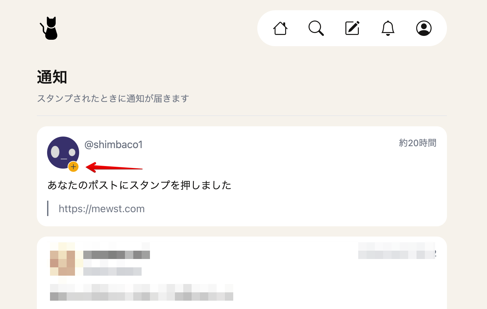

今までは通知ページに表示されるアバター画像や名前をクリックしてプロフィールページに移動しないとスタンプしてくれた人をフォローしているかどうかがわかりませんでした。

今回、通知ページに表示されるアバター画像のあたりにフォローボタンを表示するようにしました。
フォローボタンをクリックすると確認ダイアログを出しつつその人をフォローできます。

すでにフォローしている人にはフォローボタンは表示されません。
フォローを外したいときはプロフィールページに移動してください。

スタンプしてくれた人をフォローするときにぜひご活用ください。
