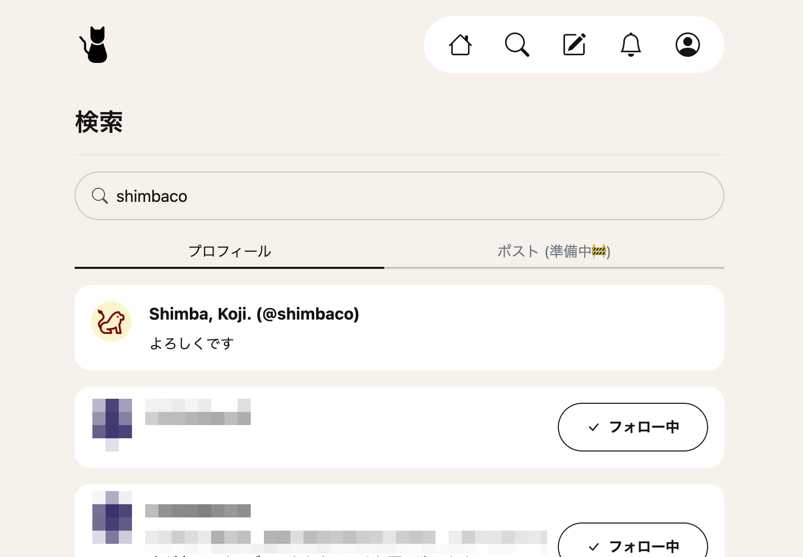

検索ページ ([mewst.com/search](https://mewst.com/search)) にキーワード入力欄を設け、プロフィール検索ができるようにしました。

入力したキーワードがアットネーム、名前、自己紹介文のどれかに含まれているプロフィールが表示されます。

キーワードは半角スペースで区切って複数入力でき、それぞれのキーワードが全て含まれているプロフィールが表示されるようになっています。

今のところなるべくお金をかけない方法 ([PostgreSQLのILIKE演算子で頑張る](https://github.com/mewstcom/mewst/blob/ae9f6cd2d42011d947070f5fac65e67b585ca15d/app/models/profile.rb#L32-L39)) で検索機能を実装しているため、
今後人が増えてきたときパフォーマンス面で問題が出てくるかもしれません。そのときは別途対策を考えます。

ポスト検索も今後実装する予定で、上のスクリーンショットのようにタブでプロフィール検索とポスト検索を切り替えられるようにする予定です。

友達のプロフィールを探すときなどにぜひご利用ください。
